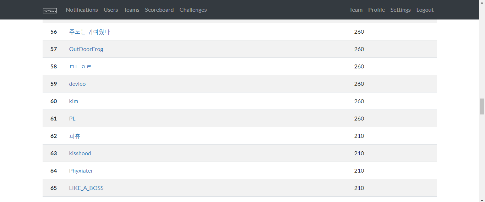
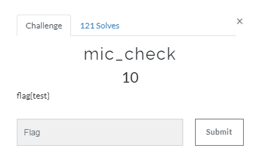
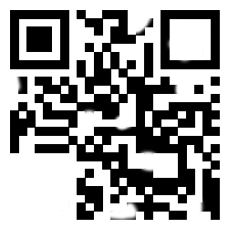
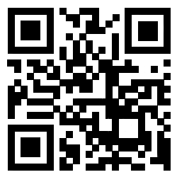
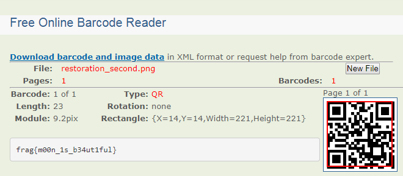
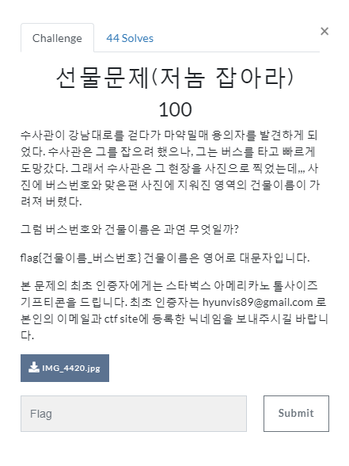

# NEWSECU CTF  
##### 2019.01.28 18:00 ~ 2019.01.29 06:00

'2019.01.29 2시 40분 기준 60등'

# Test

'flag{test}'

# restore

문제를 보면 아래와 같은 사진이 나온다.

그냥 qr 코드가 아닌 몇몇 부분이 지워진 qr 코드다.

그래서 그림판으로 지워진 부분을 다시 칠해주었다.

온라인 qr 코드 해독기에 넣으면 플래그가 나온다.

'flag{m00n_1s_b34ut1ful}'

# 선물문제(저놈 잡아라)

문제를 보면 아래와 같은 사진을 준다.

건물이름하고 버스 번호를 알아내라길래 GPS 정보를 보는줄 알았지만 건물에 써 있는 간판보고 찾으면 되는거였다.
버스번호도 검색해서 알아냈는데, 문제를 처음 봤을때는 아무도 푼 사람이 없었지만 몇명이 먼저 풀어서 상품은 못 얻었다.

flag{JUMPMILANO_1700}
